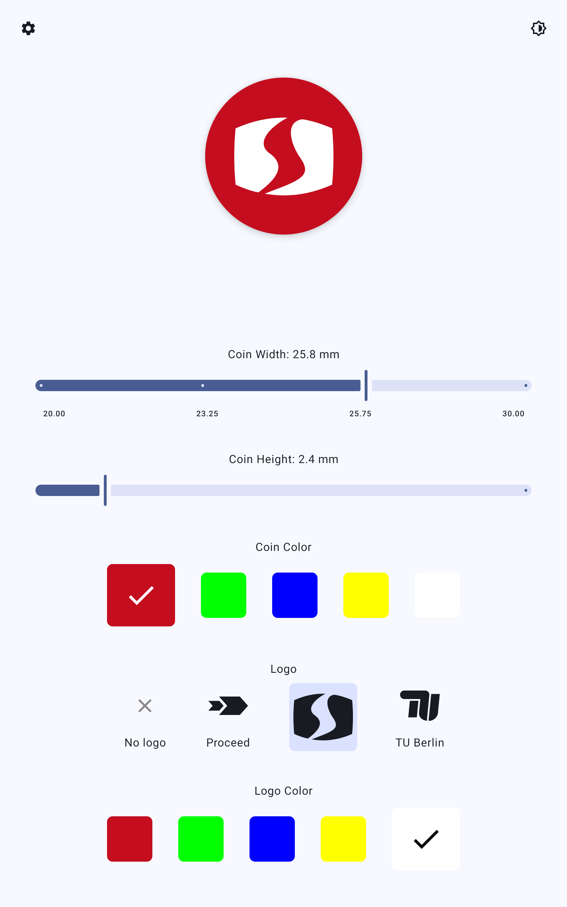

# CoinConfigurator

An Android application developed for the SNET Lab demonstrator at TU Berlin, designed to showcase interactive coin configuration capabilities during the Lange Nacht der Wissenschaften 2025 in Berlin.



## Features

- **Interactive Coin Configuration**: Real-time coin customization with visual feedback
- **Network Integration**: RESTful API integration for configuration management
- **Edge-to-Edge Design**: Modern Material Design 3 implementation
- **Multi-language Support**: Internationalization support for German and English
- **Dark/Light Theme**: Adaptive theme switching with system preference detection
- **Fullscreen Experience**: Modern fullscreen implementation using WindowInsetsController API

## Technical Stack

- **Language**: Kotlin
- **UI Framework**: Jetpack Compose
- **Architecture**: MVVM with Repository pattern
- **Networking**: Retrofit for API communication
- **State Management**: Kotlin Coroutines and Flow
- **Dependency Injection**: Manual dependency management
- **Build System**: Gradle with Kotlin DSL

## Project Structure

```
app/src/main/java/berlin/tu/snet/coinconfigurator/
├── data/                    # Data layer (preferences, language management)
├── model/                   # Data models
├── network/                 # Network layer (API services)
├── ui/                      # UI components and screens
│   ├── components/          # Reusable UI components
│   ├── screens/             # Main application screens
│   └── theme/               # Material Design theme
├── viewmodel/               # ViewModels
└── MainActivity.kt          # Main activity entry point
```

## Development Setup

### Prerequisites

- Android Studio Arctic Fox or later
- Android SDK 34 or later
- Kotlin 1.9.0 or later

### Building the Project

1. Clone the repository:
   ```bash
   git clone https://github.com/tomcory/CoinConfigurator.git
   cd CoinConfigurator
   ```

2. Open the project in Android Studio

3. Sync Gradle dependencies

4. Build and run the application

## Event Information

**Lange Nacht der Wissenschaften 2025**
- **Location**: TU Berlin, Berlin, Germany
- **Date**: 28 June 2025
- **Demonstrator**: SNET Lab, Haus der digitalen Zukunft

## Contributing

This project was developed specifically for the SNET Lab demonstrator. For questions or contributions related to the Lange Nacht der Wissenschaften event, please contact the SNET Lab team at TU Berlin.

## License

This project was developed for educational and demonstrative purposes at TU Berlin. The entire codebase is licensed under [GPLv3](https://www.gnu.org/licenses/gpl-3.0.html).
